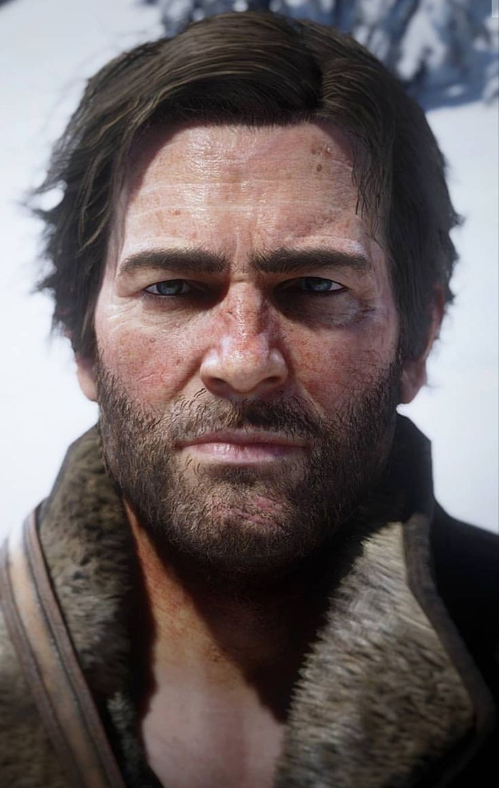
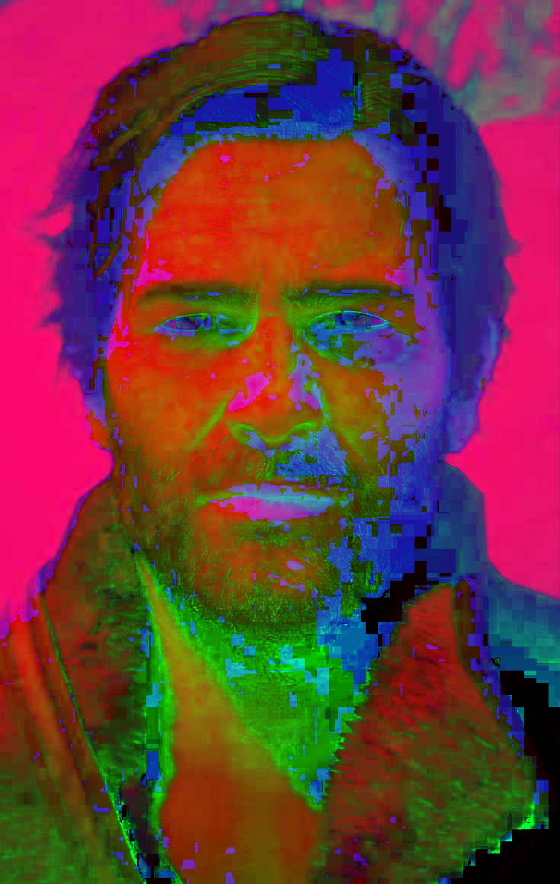
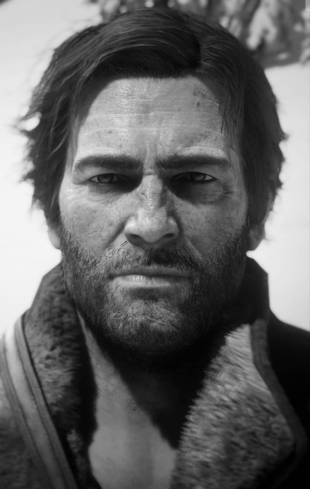
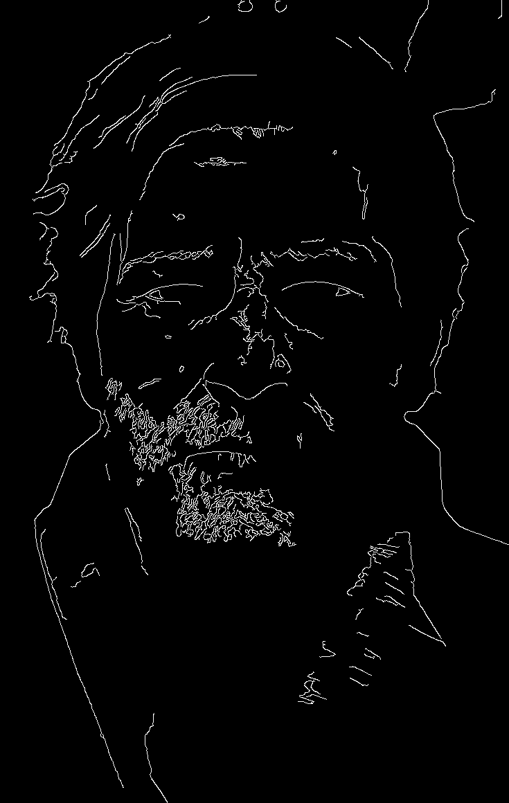
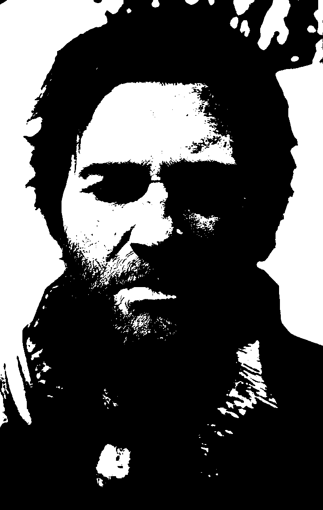

# Ejercicio 1 - Procesamiento visual e IA
## Nombre: Juan Felipe Fajardo Garzón
## Fecha de entrega: 13/06/2026

## Descripción breve:
En este ejercicio se abordan los fundamentos del procesamiento de imágenes mediante OpenCV. Se implementó un pipeline que incluye carga de imagen, conversión a escala de grises, transformación a espacio de color HSV, aplicación de filtros de suavizado, detección de bordes y segmentación por umbralización.

## Cómo ejecutar

```bash
cd ejercicio_1_procesamiento_visual/src
python main.py
```

## Herramientas usadas
* Python
* OpenCV

## Implementaciones:

### Python:
Se desarrolló un script en Python utilizando la librería OpenCV que ejecuta un pipeline de procesamiento visual secuencial. El código carga una imagen, la convierte a escala de grises usando `cv2.cvtColor`, transforma al espacio HSV, aplica suavizado Gaussiano con kernel 5x5, detecta bordes con el algoritmo Canny y realiza segmentación mediante el método de Otsu. Los resultados se visualizan en ventanas emergentes y se guardan en una carpeta de resultados.

### Decisiones tecnicas

El pipeline se configuró con decisiones técnicas orientadas a optimizar la extracción de características morfológicas y de color. La transformación al espacio HSV se implementó con el fin de separar la información de color de la intensidad lumínica, lo que permite un análisis cromático inmune a sombras o variaciones de luz global. Por su parte, la binarización se ejecutó mediante el método de Otsu, un algoritmo que analiza el histograma de la imagen de forma automática para calcular el umbral óptimo de corte entre fondo y objeto, evitando así tener que establecer un valor fijo de manera manual y garantizando una segmentación adaptable.

Para la detección de estructuras geométricas, el suavizado Gaussiano con un kernel de 5x5 se aplicó para eliminar el ruido de alta frecuencia y homogeneizar las texturas antes de buscar contornos, cuidando no difuminar los bordes principales. Posteriormente, el algoritmo de Canny procesó esta imagen suavizada utilizando un umbral inferior de 50 y uno superior de 150; esta relación de 1:3 permite que el umbral alto identifique con precisión las líneas y contornos más marcados de la composición, mientras que el umbral bajo preserva la continuidad de los bordes más tenues sin incorporar ruido visual en el resultado guardado.


## Resultados visuales:

### Python:
A continuacion se presentan las imágenes de las diferentes etapas del pipeline: la imagen original a color, su versión en escala de grises, la representación en HSV, el resultado del suavizado Gaussiano, los bordes detectados por Canny y la imagen segmentada por umbralización.

Original



Escala de grises


HSV



Suavizado



Bordes



Segmentación




## Código relevante:
El siguiente fragmento muestra el pipeline principal de procesamiento, donde se aplican las operaciones secuencialmente sobre la imagen cargada:
```python
# 1. Abrir imagen
original = cv2.imread(INPUT_IMAGE)

# 2. Escala de grises
gray = cv2.cvtColor(original, cv2.COLOR_BGR2GRAY)

# 3. Cambio de color a HSV
hsv = cv2.cvtColor(original, cv2.COLOR_BGR2HSV)

# 4. Suavizado (Gaussiano)
blurred = cv2.GaussianBlur(gray, GAUSSIAN_KERNEL, 0)

# 5. Deteccion de bordes (Canny)
edges = cv2.Canny(blurred, CANNY_THRESHOLD1, CANNY_THRESHOLD2)

# 6. Segmentacion por umbralizacion (Otsu)
_, segmented = cv2.threshold(gray, 0, 255, cv2.THRESH_BINARY + cv2.THRESH_OTSU)
```


## Prompts utilizados:
No se hizo uso de IA generativa para este ejercicio.


## Aprendizajes y dificultades:
Este ejercicio permitió comprender los conceptos fundamentales del procesamiento de imágenes digitales, incluyendo los diferentes espacios de color y su utilidad para tareas específicas como la detección por color. El espacio HSV es particularmente útil porque separa la información de matiz y saturación de la intensidad, facilitando operaciones de segmentación.

La principal dificultad fue configurar los parámetros adecuados para los filtros, especialmente los umbrales del detector Canny. Valores muy bajos detectan ruido, mientras que valores muy altos pierden bordes importantes. Se resolvieron mediante prueba y error utilizando valores típicos de la literatura.