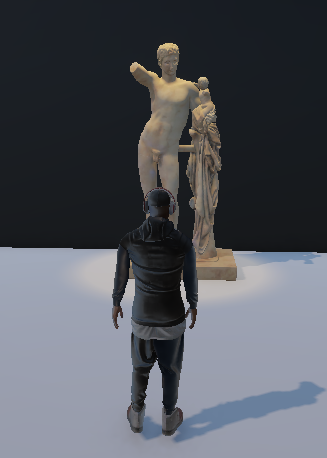
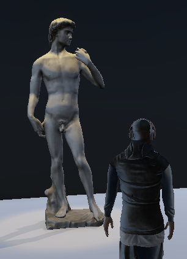
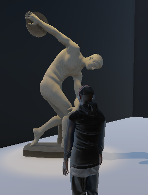
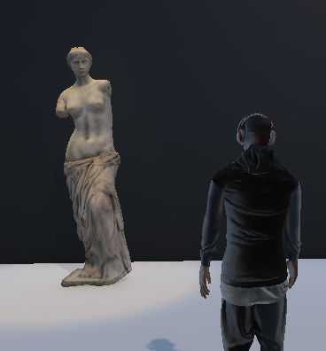
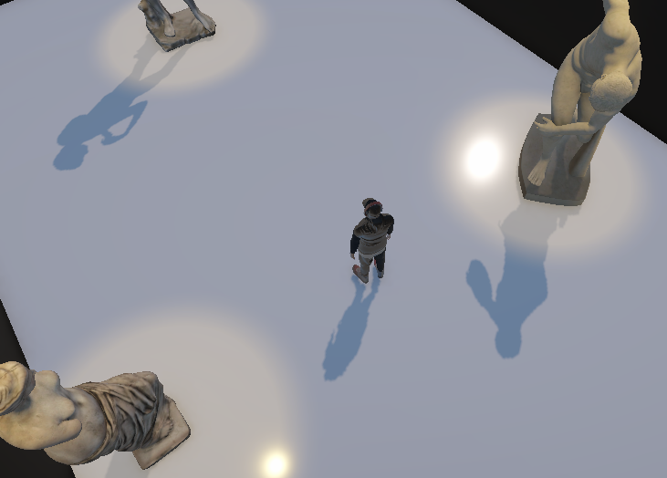
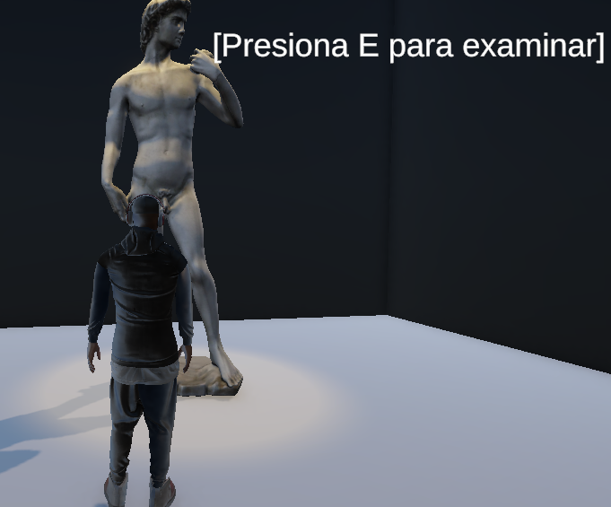
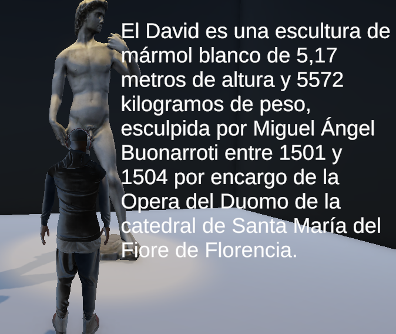

# Ejercicio 2 - Escena 3D Interactiva (Museo)
## Nombre: Juan Felipe Fajardo Garzón
## Fecha de entrega: 13/06/2026

## Descripción breve:
Este ejercicio aborda el diseño y desarrollo de un entorno virtual 3D interactivo ambientado en un museo. Se implementó un pipeline de desarrollo que abarca desde la construcción de la geometría, la aplicación de materiales PBR (Physically Based Rendering) e iluminación focal, hasta la programación del movimiento del personaje, un sistema de cámara dinámica en tercera persona y mecánicas de interacción con los elementos de la exhibición.

## Cómo ejecutar
1. Abre **Unity Hub** e importa la carpeta del proyecto.
2. Asegúrate de tener instalado el paquete **Cinemachine** y el **Input System** desde el *Package Manager*.
3. Abre la escena principal ubicada en `Assets/Scenes/SampleScene.unity`.
4. Presiona el botón **Play** en la parte superior del editor.
5. **Controles:** * Mover al personaje: Teclas `W`, `A`, `S`, `D`.
   * Control de cámara: Mover el mouse para rotar la perspectiva alrededor del personaje.
   * Interacción: Acercarse a una escultura y presionar la tecla `E`.

## Herramientas usadas
* **Motor Gráfico:** Unity (Versión compatible con Input System y Cinemachine).
* **Librerías / Paquetes:** * Cinemachine (Para el comportamiento de la cámara).
  * Unity Input System package (Manejo moderno de periféricos).
  * TextMeshPro - TMP (Para el renderizado nítido de la interfaz de usuario).
* **Lenguaje de Programación:** C# (.NET).

## Implementaciones:

### Movimiento y Animación del Personaje:
Se desarrolló el script `PJ_Actions.cs` encargado de procesar la entrada del usuario mediante *Input System*. El movimiento físico y las colisiones del avatar ("james") se gestionan a través de un componente `Character Controller`. La orientación del personaje se sincroniza dinámicamente con la rotación horizontal de la cámara. Las animaciones se controlan mediante un *Animator Controller* configurado con un *Blend Tree* de una dimensión, el cual controla los estados de *Idle* (reposo) y *Walk/Run* según la magnitud del vector de movimiento (`Speed`).

### Interacción y Entorno:
Se programó múltiples sistemas de detección y trigger volumétrico en los scripts `Interaccion(Nombre de la obra).cs` asignados a cada obra de la exhibición. Cuando el volumen del `Character Controller` del jugador entra en el espacio del `Box Collider` (configurado como *Is Trigger*) de la obra de arte, el script activa un elemento de interfaz de TextMeshPro en pantalla indicando la acción disponible. Al presionar la tecla `E`, el texto cambia en tiempo real para desplegar la información histórica o cultural correspondiente a la pieza observada.

### Decisiones técnicas

La arquitectura del script de movimiento se migró directamente a la API moderna del **Input System** (`Keyboard.current` y `Gamepad.current`), lo que garantiza la compatibilidad del software con mandos y teclados actuales de forma nativa, evitando la obsolescencia del sistema de inputs tradicional de Unity. 

Para la cámara, se optó por una configuración de perspectiva **Over the Shoulder** utilizando una **Free Look Camera de Cinemachine**.

En el apartado visual, la atmósfera del museo se configuró con un enfoque **PBR**. El material del suelo (`Suelo_marmol`) usa un valor de *Smoothness* de `0.9` para generar reflejos coherentes con las luces focales (`Spotlights`) del techo. Finalmente, todos los elementos de la galería se encuentran organizados bajo una estructura jerárquica de objetos para facilitar la traslación, escala y rotación del conjunto arquitectónico en el espacio.

## Resultados visuales:

A continuación se presentan capturas de los diferentes componentes de la escena del museo:

### Esculturas

### Hermes con el niño Dionisio



### El David



### Discobolo



### Venus de Milo




Focos de luz en cada estatua y suelo que busca simular un marmol pulido



Interfáz de interacción e información descriptiva de las estatuas





Finalmente se presenta un video de la demo completa

[Demostración funcionamiento](media/demo.mp4)

## Código relevante:

### Movimiento del personaje (`PJ_Actions.cs`):
```csharp
// Fragmento del procesamiento de entrada y movimiento
if (Keyboard.current != null)
{
    float moverHorizontal = 0f;
    float moverVertical = 0f;

    if (Keyboard.current.wKey.isPressed || Keyboard.current.upArrowKey.isPressed) moverVertical = 1f;
    if (Keyboard.current.sKey.isPressed || Keyboard.current.downArrowKey.isPressed) moverVertical = -1f;
    if (Keyboard.current.aKey.isPressed || Keyboard.current.leftArrowKey.isPressed) moverHorizontal = -1f;
    if (Keyboard.current.dKey.isPressed || Keyboard.current.rightArrowKey.isPressed) moverHorizontal = 1f;

    inputMovimiento = new Vector2(moverHorizontal, moverVertical);
}

if (inputMovimiento.x != 0 || inputMovimiento.y != 0)
{
    transform.rotation = Quaternion.Euler(0, camara.eulerAngles.y, 0);
}

Vector3 movimiento = transform.right * inputMovimiento.x + transform.forward * inputMovimiento.y;
controller.Move(movimiento * velocidad * Time.deltaTime);
```

### Mecánica de Interacción en el Museo (`Interaccion_____.cs`):
```csharp
private void OnTriggerEnter(Collider other)
{
    if (other.CompareTag("Player") || other.GetComponent<CharacterController>() != null)
    {
        jugadorCerca = true;
        informacionMostrada = false;
        if (textoUI != null)
        {
            textoUI.text = "[Presiona E para examinar]";
            textoUI.gameObject.SetActive(true);
        }
    }
}

void Update()
{
    if (jugadorCerca && Keyboard.current.eKey.wasPressedThisFrame && !informacionMostrada)
    {
        informacionMostrada = true;
        if (textoUI != null) textUI.text = mensajeDeInformacion;
    }
}
```

### Prompts utilizados:

> "Actúa como desarrollador de gráficos en Unity. Tengo un modelo 3D que se renderiza completamente blanco en la escena. Explica de forma concisa las causas más probables (errores en texturas embebidas o incompatibilidad de shaders con URP/HDRP) y provee una solución rápida paso a paso."


> "Actúa como programador de jugabilidad en Unity. Necesito configurar una cámara en tercera persona tipo 'Over the Shoulder' usando el paquete Cinemachine. Indica brevemente qué valores de Body, Aim y offsets debo modificar en el Inspector para posicionarla al lado del hombro."


> "Actúa como ingeniero de software en C#. A partir del código que te proporcionaré, realiza una refactorización para aislar únicamente la lógica de movimiento con CharacterController y la rotación de la cámara. Elimina todas las variables y métodos redundantes de UI y stamina."


> "Actúa como desarrollador de UI en Unity. Diseña un script en C# que conecte un Box Collider (como Trigger) con un elemento de TextMeshPro. El texto debe activarse mostrando '[Presiona E para examinar]' al detectar al jugador, y actualizarse con una descripción textual al presionar dicha tecla."

## Aprendizajes y dificultades:
Este ejercicio permitió consolidar el flujo de trabajo para el desarrollo de entornos interactivos tridimensionales en Unity, comprendiendo la integración de físicas mediante el Character Controller y la configuración PBR de materiales. La principal dificultad técnica radicó en la gestión de dependencias del motor, específicamente al migrar el script de movimiento a la API moderna del Input System para evitar conflictos con Cinemachine, además de corregir un error de referencia nula por la ausencia física del componente de colisión en el personaje. Ambos problemas se solventaron reestructurando la lectura directa de periféricos mediante código y calibrando manualmente la geometría de la cápsula en el editor.

Por otra parte, se presentaron contratiempos con el bucle de las animaciones en el Blend Tree, lo cual hacía que el avatar regresara abruptamente a su estado de reposo tras dar un paso; esto se resolvió aplicando de forma manual las propiedades de Loop Time y Loop Pose en los metadatos del asset. Finalmente, el correcto funcionamiento de toda la escena del museo fue verificado validando los límites de colisión contra los muros, las interacciones con las esculturas y el movimiento del jugador
